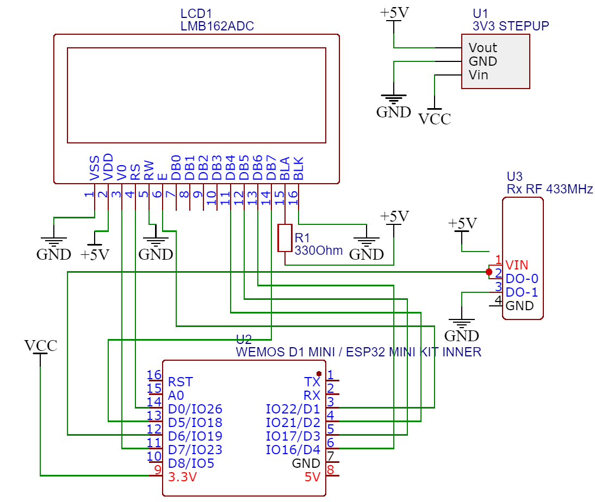

# ESP32 Wireless networks tester tool

This project is very useful as it can be used as a testing tool for wireless networks.
To control the menu of the device you'll use an RF remote, but with some simple changes to the code you can implement the use of push buttons.
The prototype will allow you to connect to a Wi-Fi network and perform basic internet tests (such as sending ping requests, measuring signal strength etc.).
This project was mainly useful for me back when wireless networks testing devices were pretty expensive and smartphone weren't that common.
The expected target audience for this project is any network administrators and microcontroller hobbyists who want to gain better understanding of microcontrollers internet connectivity.

### Main features of the project

- test your signal strength (by measuring the signal's db. or using a graphic interface).
- Send a ping request to a specified destination.
- Enable a webserver to send keyboard commands and keystrokes to the device.
- Connect to Google's NTP clock.
- To save you the time of connecting several push buttons and handling their debounce and pull down, this project uses an old RF car/gate remote to control the user interface.

### Components required

1. 1 Wemos D1 mini (or any ESP32 based microcontroller)
2. 1 LCD 1602 (you can use any other display but you'll have to change the code accordingly)
3. 1 433MHz/315MHz receiver
4. 1 433MHz/315MHz remote (used to control the user interface of the prototype)

You can use 3 push buttons instead of the RF remote, but you'll need to multiplex them (as there are not enough pins in the Wemos D1) and change the code accordingly.

### Schematic diagram

                           
To supply power to the circuit you can use the Arduino USB connector or the Power supply connector (on Arduino Uno).

### Description of the system

The ESP32 has a built in SoC and antenna that enables Wi-Fi communication, the microcontroller is connected to the network using SSID and password (if required).

The microcontroller keeps track of the previously connected networks and offers to save their passwords.

After connecting to a desired network you can navigate the menu to choose which test you would like to perform.

## Code

Code is available [here](Code/Main_-_WeMos)

Webpage files are located [here](Code/webpage_data)

### Watch this project in action

Examine this demo video

 
